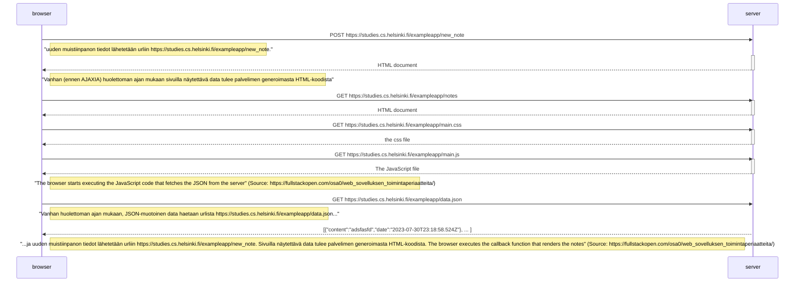

```mermaid
sequenceDiagram
    participant browser
    participant server

    browser->>server: POST https://studies.cs.helsinki.fi/exampleapp/new_note
    Note right of browser:"uuden muistiinpanon tiedot lähetetään urliin https://studies.cs.helsinki.fi/exampleapp/new_note."
    activate server
    server-->>browser: HTML document
    deactivate server
    Note right of browser:"Vanhan (ennen AJAXIA) huolettoman ajan mukaan sivuilla näytettävä data tulee palvelimen generoimasta HTML-koodista"
    
    browser->>server: GET https://studies.cs.helsinki.fi/exampleapp/notes
    activate server
    server-->>browser: HTML document
    deactivate server
    
    browser->>server: GET https://studies.cs.helsinki.fi/exampleapp/main.css
    activate server
    server-->>browser: the css file
    deactivate server
    
    
    browser->>server: GET https://studies.cs.helsinki.fi/exampleapp/main.js
    activate server
    server-->>browser: The JavaScript file
    deactivate server    

    Note right of browser: "The browser starts executing the JavaScript code that fetches the JSON from the server" (Source: https://fullstackopen.com/osa0/web_sovelluksen_toimintaperiaatteita/)
    

    browser->>server: GET https://studies.cs.helsinki.fi/exampleapp/data.json
Note right of browser: "Vanhan huolettoman ajan mukaan, JSON-muotoinen data haetaan urlista https://studies.cs.helsinki.fi/exampleapp/data.json..."
    activate server
    server-->>browser: [{"content":"adsfasfd","date":"2023-07-30T23:18:58.524Z"}, ... ]
    Note right of browser: "...ja uuden muistiinpanon tiedot lähetetään urliin https://studies.cs.helsinki.fi/exampleapp/new_note. Sivuilla näytettävä data tulee palvelimen generoimasta HTML-koodista. The browser executes the callback function that renders the notes" (Source: https://fullstackopen.com/osa0/web_sovelluksen_toimintaperiaatteita/)
```
    
