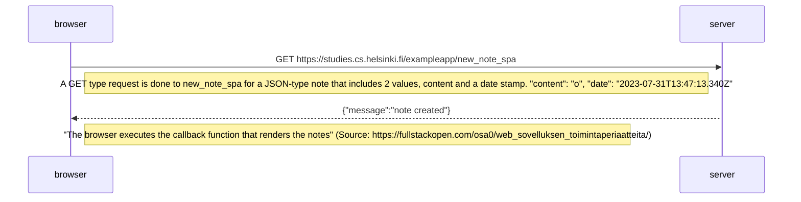

```mermaid
sequenceDiagram
    participant browser
    participant server
    
    browser->>server: GET https://studies.cs.helsinki.fi/exampleapp/new_note_spa
    Note right of browser: A GET type request is done to new_note_spa for a JSON-type note that includes 2 values, content and a date stamp. "content": "o", "date": "2023-07-31T13:47:13.340Z"

    activate server
    server-->>browser: {"message":"note created"}
    Note right of browser: "The browser executes the callback function that renders the notes" (Source: https://fullstackopen.com/osa0/web_sovelluksen_toimintaperiaatteita/)
```
    
